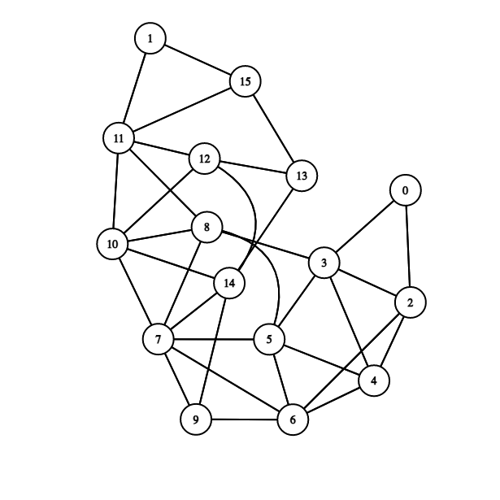
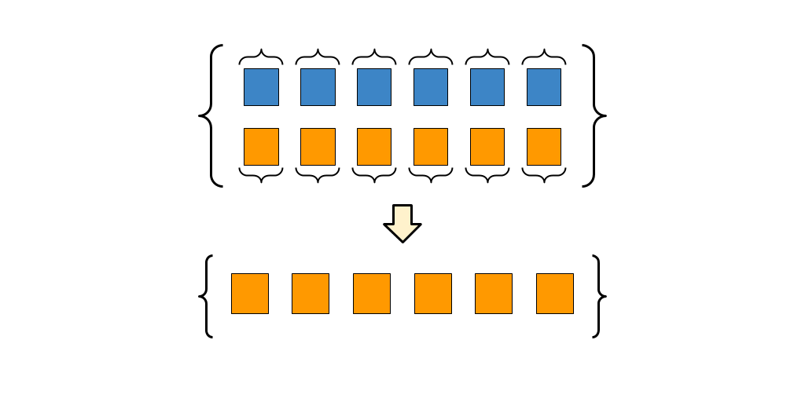

# ¿TE PERDIS-TEC? Integral B Avance 1 (Grafos)
Olivia Araceli Morales Quezada (A01707371)

La finalidad de este proyecto es implementar grafos por medio de un programa que mapea el area de profesional del TEC y crea un grafo con el que podemos ver los sitios mas cercanos a nuesta ubicación y en caso de querer llegar a un lugar en especifico la ruta más optima. 

Imagenes del mapa del TEC y el grafo generado:




## Competencias a evaluar

###SICT0301B: Evalúa los componentes

**Presenta Casos de Prueba correctos y completos para todas las funciones y procedimientos del programa**

En el archivo *casosprueba.cpp* extisten tests con todas las funciones de *grafos* y *pairs* utilizadas en este programa probadas para demostrar que si funcionan.

**IMPORTANTE:** Para poder correr el archivo, se debe sustituir el archivo *main.cpp* principal, ya sea solo descargar uno de los dos o cambiar su contenido por el del otro para que se pueda.

### SICT0302B: Toma decisiones

**Usa grafos para hacer analisis de información** 

En el archivo _mapa.txt_ se encuentran las relaciones adyacentes de los lugares del TEC, estos van a guardarse en una lista de adyacencia ya que su proposito es mostrar rutas generadas a partir de las busquedas del grafo con esta información. 

**Usa un algoritmo de búsqueda en grafos adecuado para resolver un problema**

Para esta situación el algoritmo de búsqueda seleccionado fue un BFS, a diferencia del DFS este te muestra el camino más corto, y es el adecuado para mostrarte la ruta más óptima para llegar a donde quieras. 

### SICT0303B: Implementa acciones científicas (Ya calificada en Integral A)

**Implementa mecanismos de lectura de archivos correctos y útiles dentro de un programa.** 

Se leen los datos del archivo "mapa.txt", este proceso se encuentra en la funcion _cargarLista()_, implementada en la linea 25 de _main.cpp_.

### SEG0702A: Tecnologías de Vanguardia

**Investiga e implementa un algoritmo o una estructura de datos que no se vió durante el curso.**

La extructura extra seleccionada para esta integral fue un _**pair**_ de la libreria _<utility>_, estos son un caso particular de tupla, un objeto capaz de contener una colección de elementos donde cada elemento puede ser de un tipo diferente. 



Los _**pair**_, como bien dice su nombre, forma un par de valores, que pueden ser de diferentes tipos. Se puede acceder a los valores individuales a través de sus miembros públicos _first_ y _second_.

```
template <class U1, class U2>
  tuple (pair<U1,U2>&& pr);

template <class T1, class T2> struct pair;
```
En este caso los utilice porque necesitaba asociar a cada lugar del mapa un numero y de esta forma facilitar la lectura de coordenadas del grafo, asi no utilizaria un nombre sino el numero correpondiente. 

**Describe cada algoritmo de la estructura (inserción, consulta, etc...) de forma clara y con ejemplos.**

## Grafos

**Cargar lista:** Esta función se basa en una lectura de un archivo por lo que su complejidad es O(n), estos datos se introducen a una lista cuya complejidad es de O(1); la complejidad de la funcion es O(n).

**Añadir lista:** Se ingresan las coordenadas y esta las añade en la lista, que en realidad es un vector, este tiene una complejidad de 0(1) ya que se insertan directamente al final con el _pushback()_.

**Ver los sitios cerca: ** Al ingresarle un valor parte de la lista, este metodo regresa por medio de un ciclo sus adyacentes, o sea, los valores que estan juntos, a un paso.

**Obtener camino corto:** Para obtener una ruta corta se utiliza un BFS.

**Impresiones de rutas:** Al imprimir se utilizan ciclos que recorren la estructura segun se lo indique.

**Make_pair:** Construye un objeto par con su primer elemento establecido en x y su segundo elemento establecido en y.
```
template <class T1,class T2>
  pair<T1,T2> make_pair (T1 x, T2 y)
  {
    return ( pair<T1,T2>(x,y) );
  }
```
**Fisrt & Second:** Permite acceder al primer o al segundo elemento de la pareja formada.
```
pair (const first_type& a, const second_type& b);
template<class U, class V> pair (U&& a, V&& b);
```
## Consideraciones
- Solo ingresar los numeros que corresponden a cada lugar, no el nombre.
- Puedo contar con una mano las veces que he pisado el TEC, y casi me perdí con el guia (@AudibleP) es posible que existan algunos errores o carencias, es solo un ejemplo que se me ocurrio para implementar grafos.

**Referencias**

- Información de los pair: https://www.cplusplus.com/reference/utility/pair/pair/
- Pagina para generar el grapho: https://csacademy.com/app/graph_editor/ 
